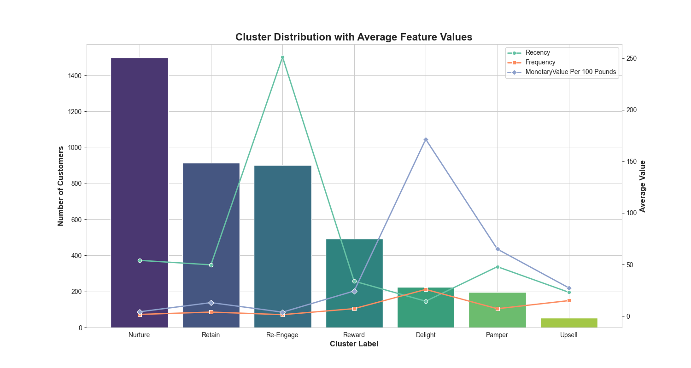

# Online Retail Customer Analysis

This project focuses on understanding customer behavior through an in-depth analysis of transaction data from an online retail store. By utilizing K-Means clustering, it uncovers insights that help businesses better understand their customer base and make informed strategic decisions. This analysis applies the Recency, Frequency, and Monetary (RFM) framework to profile customers effectively.

**Dataset:** [Online Retail II](https://archive.ics.uci.edu/dataset/502/online+retail+ii)

## Key Features for Analysis

The analysis focuses on three primary metrics:

- **Recency:** Number of days since a customer’s last purchase.
- **Frequency:** Total number of purchases made by a customer.
- **Monetary Value:** Total monetary contribution of each customer

### Final Clustering Result



## Getting Started

To begin, ensure that Python 3.8+ is installed on your local machine.

### Clone the Repository

```bash
git clone git@github.com:abdullahashfaq-ds/Online-Retail-Customer-Analysis.git
cd Online-Retail-Customer-Analysis
```

### Virtual Environment Setup

```bash
python -m venv venv
# On Windows, use:
venv\Scripts\activate
# On Linux/MacOS, use:
source venv/bin/activate
# To set up the environment:
pip install -r requirements.txt
```

Once the environment is set up, open the Jupyter notebook to start the analysis.

## License

This project is licensed under the MIT License. See the [LICENSE](LICENSE) file for more details.
